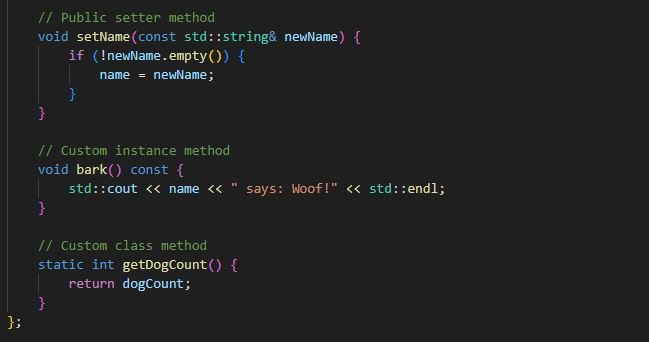

## Classes & Objects

A **class** is a *blueprint* or *template* for creating objects. It defines the **properties** (also known as *attributes*, *fields*, or *data members*) and **behaviors** (also known as *methods*, *operations*, or *member functions*) that the objects created from the class will have. Classes essentially allow for the creation of **custom types**.

An **object** (also known as an *entity*) is an **instance** of a class. When an object is created from a class, we say it was *instantiated* from that class. Objects typically represent things from the real world but can be anything you want to store and process data about.

## Table of Contents

👉 **Example:**

### Attributes and Methods
---
#### Instance vs Class Attributes
#### Instance vs Class Methods
### Validating Attributes
---
### Mutability
---
### Properties, Getters & Setters
---
### Access Modifiers
---
### Special Methods
---
#### Constructor
#### Copy Constructor
##### Shallow Copy vs Deep Copy
#### Destructor
#### Operator Overloading
### Interface vs Implementation
---

The **interface** includes the properties and methods a program (or programmer) can interact with.

The **implementation** consists of the internal logic—data structures and methods—that work behind the scenes  
and are usually modified only by the class creator.

> In some programming languages, it's common to separate these into different files (e.g., header and source files in C++).

### Abstract Classes
---
An **abstract class** is a blueprint for other classes, serving as a foundation for creating more specific, **concrete classes**.

It **cannot be instantiated directly**, and it often contains **abstract methods** that must be implemented by its subclasses.

Abstract classes are used to define common characteristics and behaviors that multiple related classes share,  
promoting **code reuse** and **organization**.

### Dependency Injection
---
